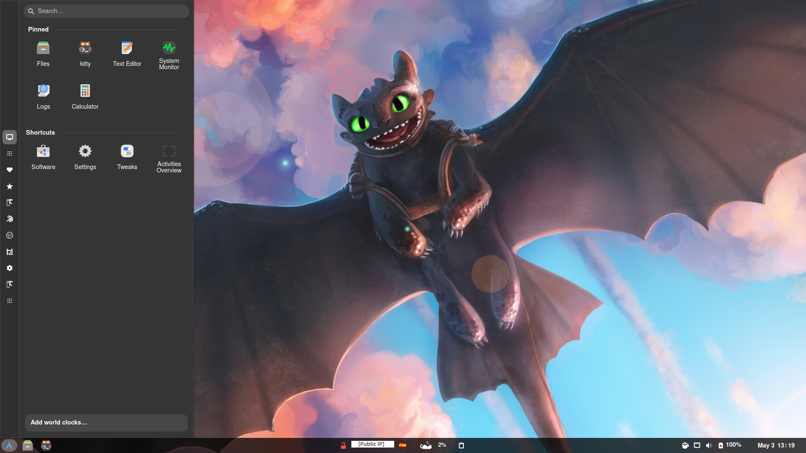
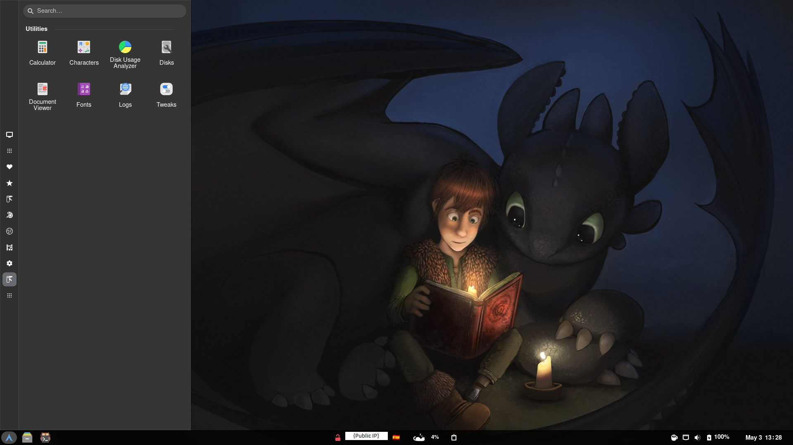

# ArchCat - An Arch Linux-based Distribution
Welcome to ArchCat, a lightweight and customizable Linux distribution based on Arch Linux. ArchCat is designed to provide a streamlined installation process while offering a flexible and robust system. This README will guide you through the setup process, explain the checkpoint system, and provide troubleshooting tips.

## Table of Contents
1. [Project Overview](#project-overview)
2. [Key Features](#key-features)
3. [Requirements](#requirements)
4. [Checkpoint System](#checkpoint-system)
5. [Installation Instructions](#installation-instructions)
6. [Archat CLI](#archat-cli)
7. [Additional Resources](#additional-resources)

## Project Overview
ArchCat is designed to offer a quick and flexible installation process for users seeking a customized Arch Linux-based environment. It features a comprehensive installation script with checkpoints to ensure a smooth setup experience.

## Key Features
ArchCat offers a variety of features to enhance the Arch Linux experience, including:

- **Rolling Release**: ArchCat is based on Arch Linux, offering a rolling release model with constant updates, ensuring you're always up-to-date with the latest packages.
- **Kitty Terminal**: The default terminal emulator is Kitty, known for its speed, features, and customization options.
- **Zsh with Oh My Zsh and Powerlevel10k**: ArchCat uses Zsh as the default shell, enhanced with Oh My Zsh and the Powerlevel10k theme, providing a modern and visually appealing command-line experience.

- **Minimal Bloat**: ArchCat focuses on a minimal installation, allowing you to customize your system as needed without unnecessary software.
- **Archat CLI**: The Archat command-line interface allows for quick and easy installation of predefined modules, representing specific groups of software packages, system configurations, or additional repositories.
- **Virtual Machine Support**: ArchCat is compatible with popular virtual machine platforms such as VirtualBox and VMware, enabling you to run ArchCat in a virtual environment with guest addittions or vmware tools

- **Customized Gnome Desktop**: ArchCat offers a customized Gnome desktop environment, providing a sleek and user-friendly interface. 
Here's an example of the ArchCat desktop environment, showing light and dark modes:

<table>
  <tr>
    <td></td>
    <td></td>
  </tr>
</table>
Note: The ip finder plugin's public ip widget is hidden from these images for privacy reasons.

## Requirements
Before installing ArchCat, ensure your system meets the following requirements:

- **Hardware Requirements**:
  - 2 GB or more of RAM
  - At least 20 GB of disk space.
  - An internet connection

- **Software Requirements**:
  - A bootable Arch Linux installation environment
  - Ability to get the code on the Archiso installer via USB or Git

## Checkpoint System
ArchCat uses a [Checkpoint system](https://github.com/ThomasMTT/checkpoint-sh) to ensure a seamless installation process. 
The installation script creates checkpoint files to track the last completed step.  
If the script is interrupted or an error occurs, the checkpoint system allows you to resume from the last completed step.

## Installation Instructions

1. **Prepare the Arch Linux Environment**:
   - Boot into the Arch Linux installation environment.
   - Ensure your system has internet access.
   - Set the keyboard layout: `loadkeys es` (for Spanish layout).

2. **Install Git**:
   - Use the package manager to install Git: `pacman -Sy git`.

3. **Clone the ArchCat Repository**:
   - Use Git to clone the ArchCat repository: `git clone https://github.com/ThomasMTT/archcat-linux.git`.

4. **Install ArchCat**:
   - Navigate to the Archcat-linux directory: `cd /archcat-linux`.
   - Make all scripts executable: `chmod -R +x ./*`.
   - Run `./install.sh` to start the installation process.
   - Follow the on-screen prompts to complete the setup.

## Archat CLI
The [Archat command](https://github.com/ThomasMTT/archcat-cli) allows you to install predefined modules, representing specific groups of software packages, system configurations, or additional repositories. 
To use "archat" simply run the command from a terminal after completing the initial Archcat installation.

### Using Archat
1. **Run Archat**:
   - Open a terminal and type `archat`.
   - A menu will appear with various module options.

2. **Select Modules**:
   - Use the menu to choose which modules to install.
   - Confirm your selections to initiate the installation process.

3. **Complete Installation**:
   - Follow the prompts to complete module installation.
   - After the process is complete, you might need to reboot your system for some changes to take effect.

#### Additional Notes
- **Updates:** [Archat-Cli](https://github.com/ThomasMTT/archcat-cli) will update itself on executing `archat` if a newer version is available 

## Additional Resources
For more information and additional support, you can visit the following resources:

**ArchCat Repositories**
- **ArchCat Linux GitHub Repository**: [Archcat-Linux GitHub Repository](https://github.com/ThomasMTT/archcat-linux)
- **ArchCat CLI GitHub Repository**: [Archcat-Cli GitHub Repository](https://github.com/ThomasMTT/archcat-cli)

**Arch Linux Troubleshooting**
- **Arch Linux Installation Guide**: [Arch Linux Installation Guide](https://wiki.archlinux.org/title/Installation_guide)
- **Arch Linux General Troubleshooting**: [Arch Linux Troubleshooting](https://wiki.archlinux.org/title/Troubleshooting)
- **Arch Linux Forums**: [Arch Linux Forums](https://bbs.archlinux.org/)